# Kova Hand

[繁體中文](README.md) | [English](README.en.md)

Kova Hand 是一款開源、由腱繩驅動的低成本機械手，核心材料成本控制在新台幣 1,000 元以內。專案包含 3D 列印模型、ESP32-C3 韌體與 Windows 桌面控制軟體，可透過 BLE 獨立控制五根手指，並選用攝影機手勢跟隨或 LLM 自然語言動作控制。

## 成品展示

<p align="center">
  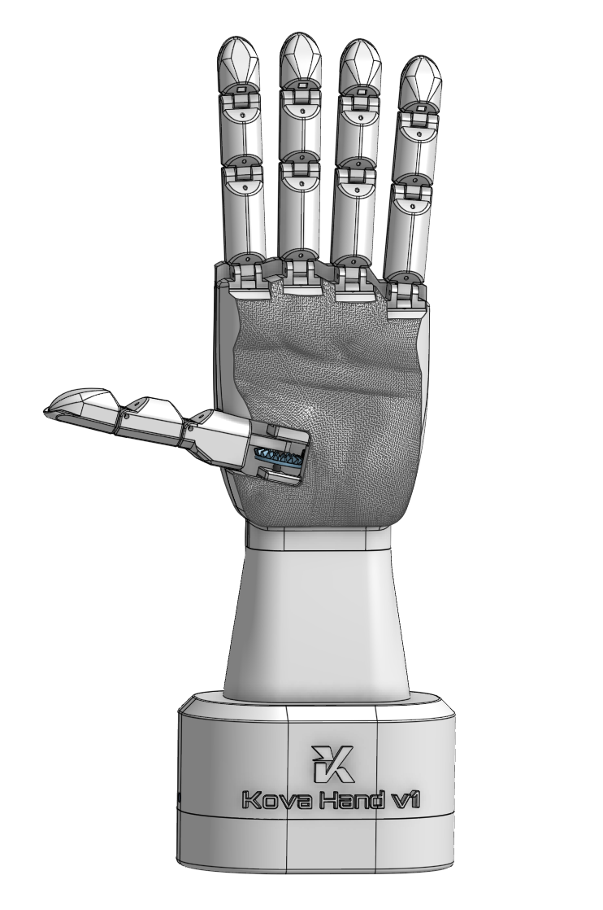
</p>

### 桌面控制軟體

<p align="center">
  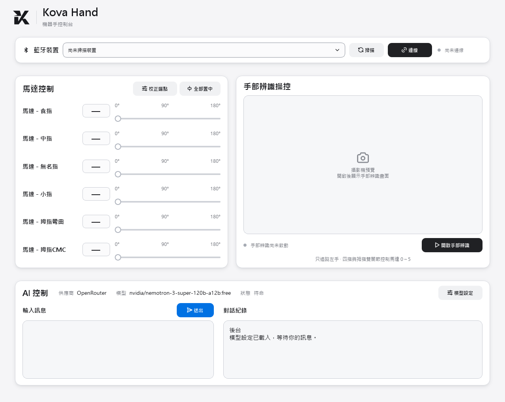
</p>

## 主要功能

- 獨立調整與控制五根手指
- 透過 BLE 無線連接 ESP32-C3 SuperMini
- 使用 MediaPipe 即時辨識並跟隨手部動作
- 透過 LLM 理解自然語言指令並執行對應動作
- 支援伺服馬達端點校正
- 提供圖形化桌面控制軟體

## 硬體需求與材料清單

以下價格為新台幣參考價格，未含運費。

| 材料 | 數量 | 參考價格 | 用途 |
|---|---:|---:|---|
| ESP32-C3 SuperMini 開發板 | 1 | NT$80 | BLE 通訊與主要控制 |
| 已焊接 PCA9685 伺服馬達驅動板 | 1 | NT$98 | 控制六顆伺服馬達 |
| SY8205 5V／5A 降壓模組 | 1 | NT$50 | 將外部電源降壓至 5V，供伺服馬達使用 |
| 5.5 × 2.1 mm DC 母座轉螺絲端子 | 1 | NT$5 | 連接外部電源 |
| MG90S 180° 伺服馬達 | 6 | NT$348 | 控制五根手指，其中拇指使用兩顆 |
| 0.8 mm 以下透明尼龍釣魚線 | 適量 | NT$50 | 作為驅動手指的腱繩 |
| 18～20 AWG 紅黑電源線 | 約 20 cm | NT$5 | 連接 DC 母座、SY8205 與 PCA9685 |
| 2.54 mm 母對母杜邦線 | 4 | NT$10 | 連接 ESP32-C3 SuperMini 與 PCA9685 |
| PLA 或 PETG 3D 列印耗材 | 依據實際用量 | NT$150 | 列印機械手本體與底座 |
| M2 × 6 mm 自攻螺絲 | 20 | NT$20 | 固定機械結構 |
| M2 × 12 mm 自攻螺絲 | 20 | NT$20 | 固定機械結構 |
| Ø2 × 10 mm 定位銷 | 5 | NT$10 | 手指關節定位 |
| Ø2 × 16 mm 定位銷 | 10 | NT$20 | 手指關節定位 |
| Ø3 × 26 mm 定位銷 | 1 | NT$5 | 機械結構定位 |
| 線徑 0.4 × 外徑 4 × 長 70／80 mm 拉伸彈簧 | 5 | NT$20 | 手指回彈 |
| 線徑 0.4 × 外徑 4 × 長 60 mm 拉伸彈簧 | 1 | NT$4 | 拇指回彈 |

**預估核心材料成本：約 NT$895**

3D 列印成本僅估算耗材，不包含印表機、電費與代印費用。

DC 端子須使用 **5.5 mm 外徑、2.1 mm 內徑的母座轉螺絲端子**；SY8205 須選擇 **5V 輸出版本**。

### 材料外觀參考

下圖僅供辨識外觀，請以材料表中的規格與數量為準。

| | | |
|:---:|:---:|:---:|
| 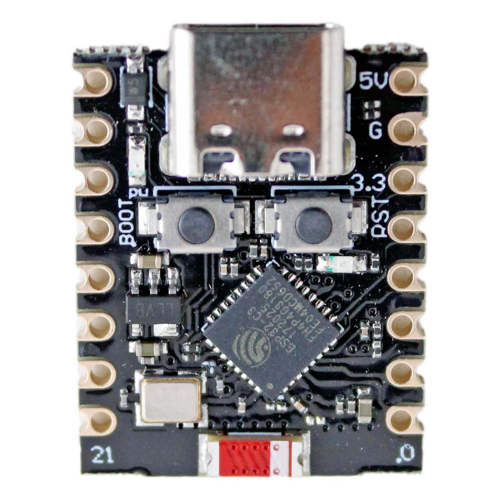<br>ESP32-C3 SuperMini | 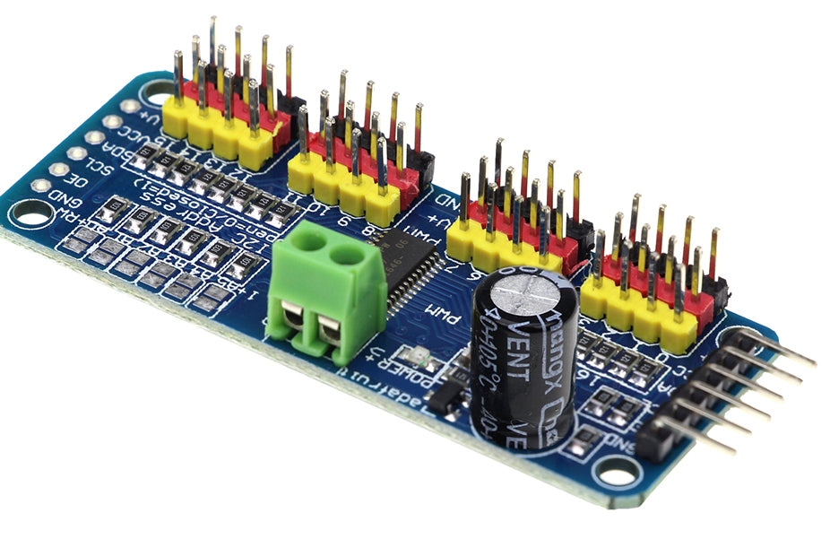<br>已焊接 PCA9685 驅動板 | 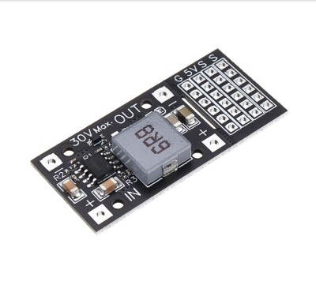<br>SY8205 5V／5A 降壓模組 |
| 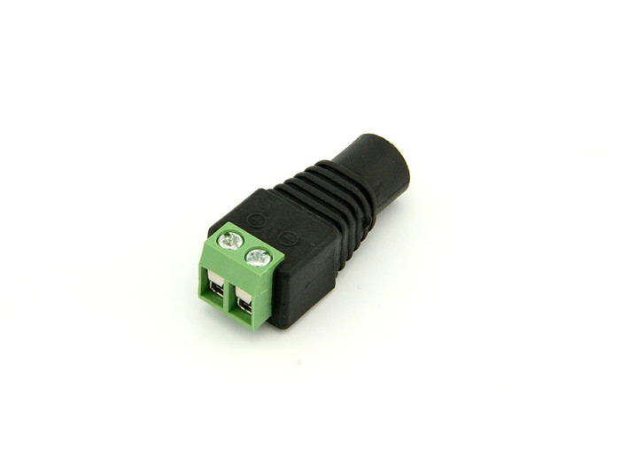<br>5.5 × 2.1 mm DC 母座 | 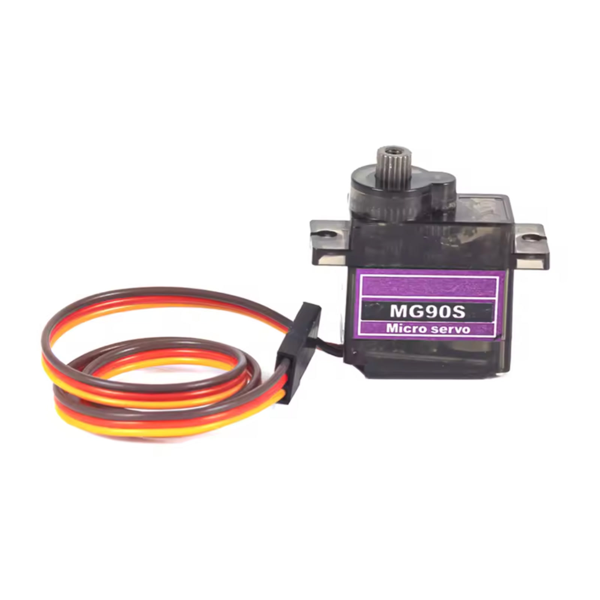<br>MG90S 伺服馬達 | 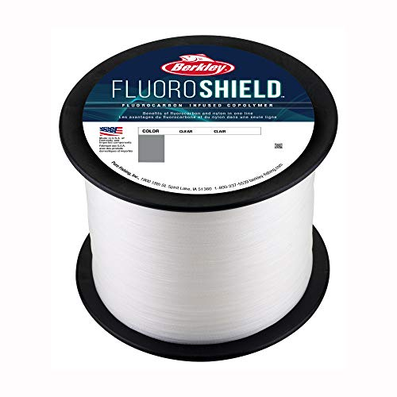<br>透明尼龍釣魚線 |
| 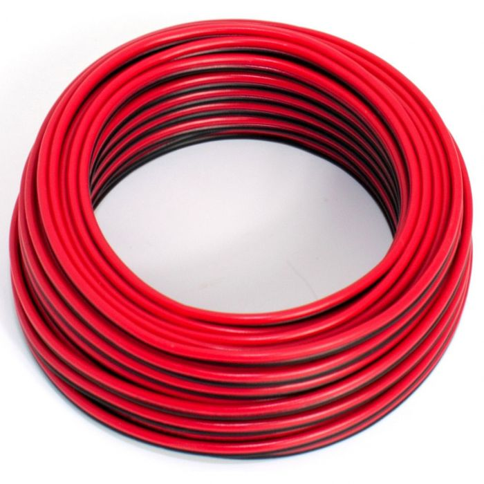<br>18～20 AWG 紅黑電源線 | 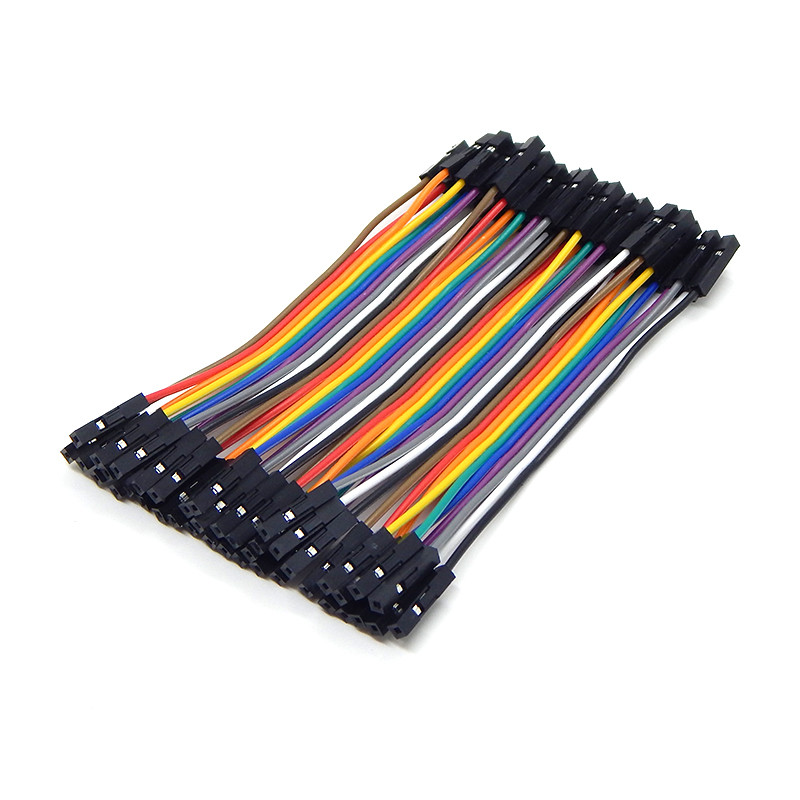<br>2.54 mm 母對母杜邦線 | 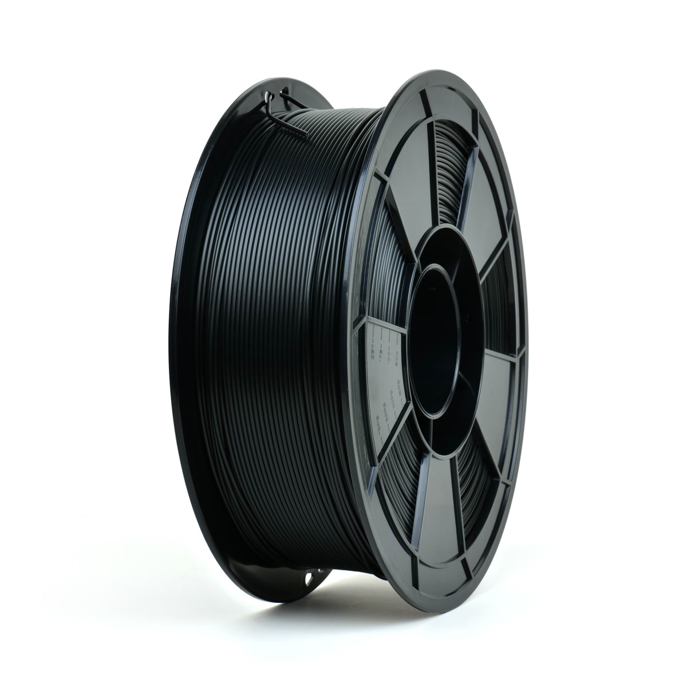<br>PLA／PETG 列印耗材 |
| 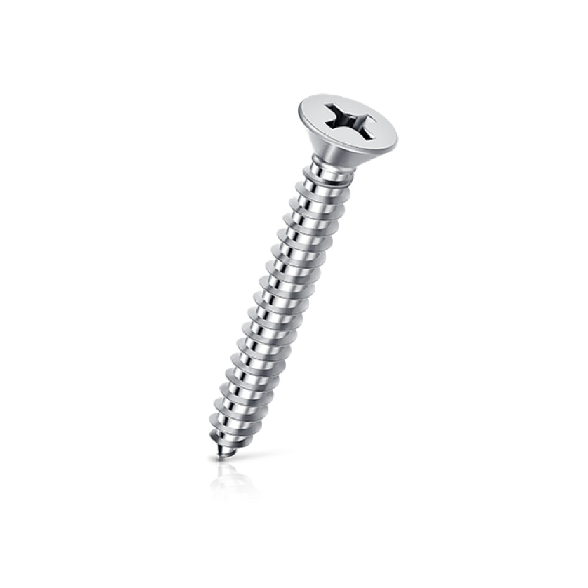<br>M2 自攻螺絲 | 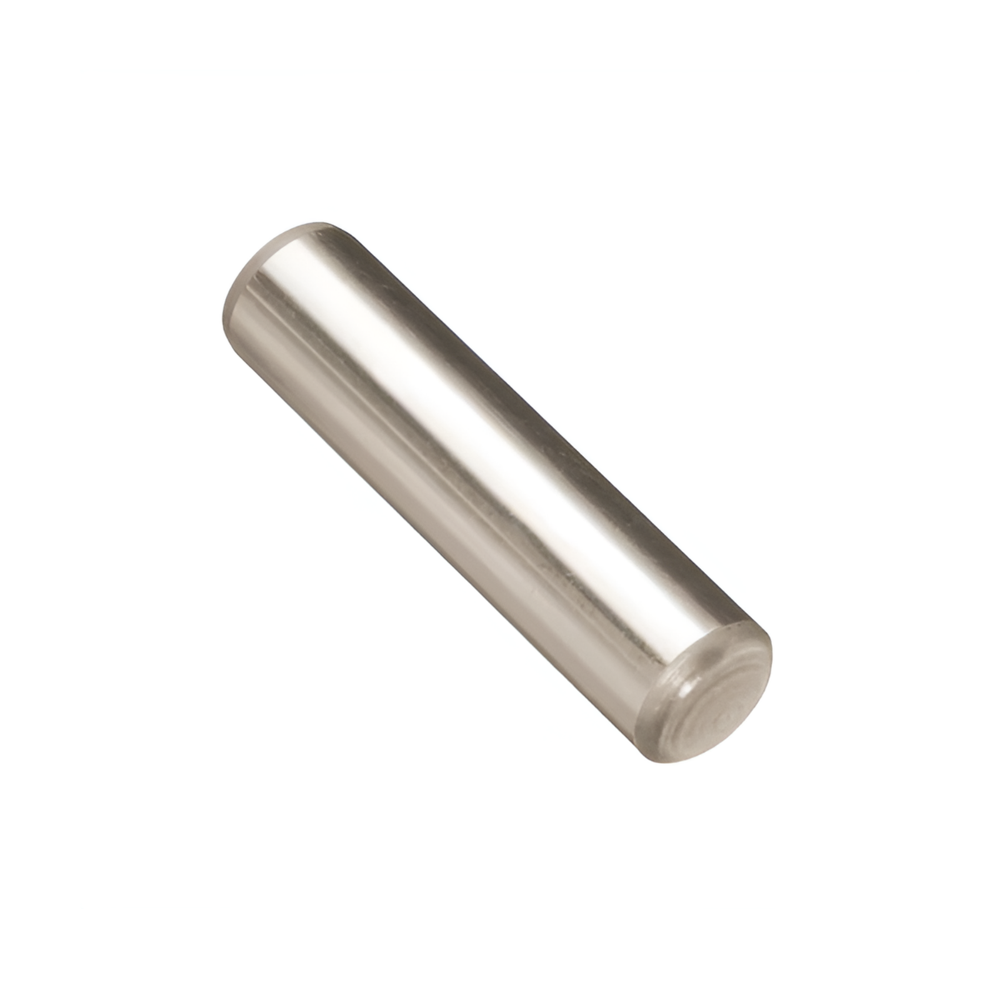<br>2 mm 定位銷 | 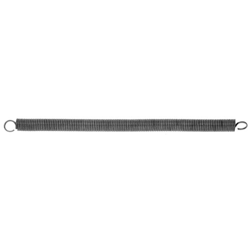<br>拉伸彈簧 |

### 額外設備

- USB Type-C 傳輸線，用於 ESP32-C3 SuperMini 燒錄與除錯
- DC 電源線與電源供應器
- 攝影機，僅手部動作跟隨功能需要

## 3D 列印模型

<p align="center">
  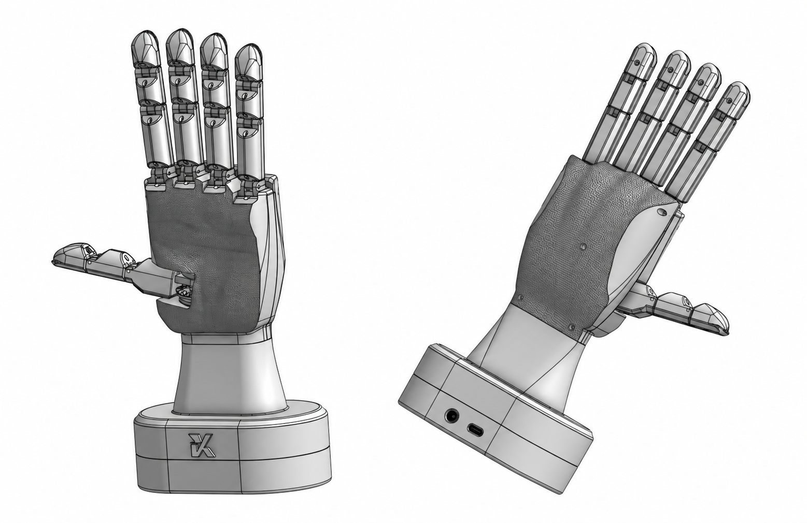
</p>

可在 [Onshape 線上模型](https://cad.onshape.com/documents/ccffffec5822f67dead6a1cb/w/ebebf107b7355267c1a8c3b4/e/881fbe2581adab1d2883eabd?renderMode=0&uiState=6aba7c43a2a35e1afe7ee9ef) 檢視模型與組裝結構。

### STL 模型

STL 模型將透過 [GitHub Releases](https://github.com/DeL1215/Kova-Hand/releases) 提供。

### Bambu Studio 3MF 配置

另提供 Bambu Studio 3MF 列印配置。

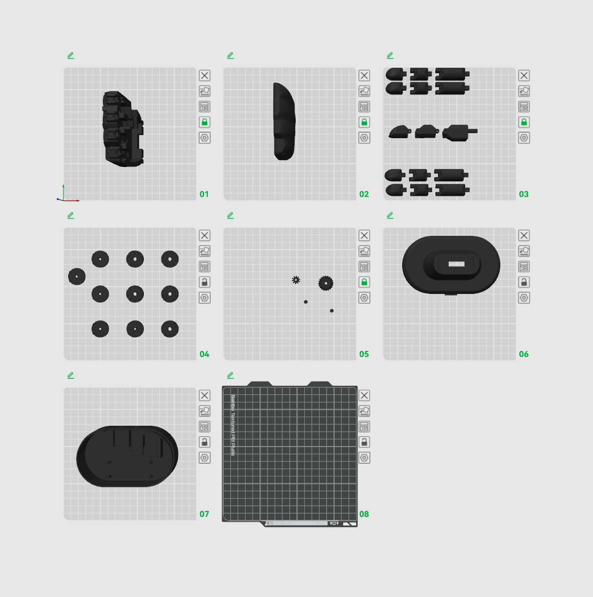

> [!WARNING]
> **齒輪不建議使用啞光 PLA 或其他啞光耗材。** 啞光材料通常較脆，齒牙受力時容易崩斷；建議改用一般 PLA、PLA+ 或韌性較好的 PETG。

## 電路接線

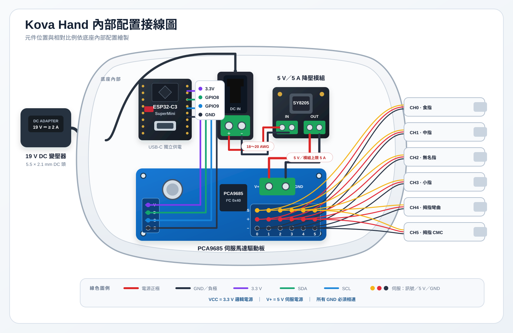

| 來源 | 連接至 |
|---|---|
| DC 母座 `+` | SY8205 `IN+` |
| DC 母座 `−` | SY8205 `IN−` |
| SY8205 `OUT+` | PCA9685 `V+` |
| SY8205 `OUT−` | PCA9685 電源端子 `GND` |
| ESP32-C3 `3.3V` | PCA9685 `VCC` |
| ESP32-C3 `GPIO8` | PCA9685 `SDA` |
| ESP32-C3 `GPIO9` | PCA9685 `SCL` |
| ESP32-C3 `GND` | PCA9685 `GND` |

PCA9685 的 CH0～CH5 依序連接食指、中指、無名指、小指、拇指彎曲與拇指 CMC 伺服馬達。

## 韌體燒錄

韌體支援 PlatformIO 與 Arduino IDE。

### PlatformIO

1. 安裝 Visual Studio Code 與 PlatformIO IDE 擴充套件。
2. 使用 PlatformIO 開啟專案中的 `firmware` 資料夾。
3. 使用具備資料傳輸功能的 USB Type-C 線連接 ESP32-C3 SuperMini。
4. 選擇環境 `esp32-c3-devkitm-1`，點擊 **Upload**。

### Arduino IDE

1. 安裝 **ESP32 by Espressif Systems 2.0.17**。
2. 在函式庫管理員安裝：
   - `Adafruit PWM Servo Driver Library 3.0.3`
   - `NimBLE-Arduino 1.4.3`
3. 開啟 `firmware/KovaHand/KovaHand.ino`。
4. 選擇 **ESP32C3 Dev Module** 與正確的連接埠，將 **USB CDC On Boot** 設為 **Enabled**。
5. 點擊 **上傳**。

## 軟體安裝

### 系統需求

- Windows 10 或 11，並具備 Bluetooth Low Energy
- Python 3.11
- Git
- 網路連線，用於安裝套件與下載 MediaPipe 模型

攝影機與 LLM API Key 為選用項目。

### 1. 下載專案

```powershell
git clone https://github.com/DeL1215/Kova-Hand.git
cd Kova-Hand
```

### 2. 建立虛擬環境

```powershell
py -3.11 -m venv kova-hand-env
.\kova-hand-env\Scripts\Activate.ps1
```

### 3. 安裝必要套件

```powershell
python -m pip install -r requirements.txt
```

### 4. 下載手部辨識模型

```powershell
python scripts\download_hand_model.py
```

### 5. 確認安裝結果

```powershell
python scripts\check_install.py
```

## 啟動控制軟體

在專案根目錄執行：

```powershell
.\kova-hand-env\Scripts\Activate.ps1
python desktop-app\main.py
```

## 專案結構

```text
Kova-Hand/
├── Images/
│   ├── components/              # 電子零件參考圖
│   ├── printing/                # 列印配置畫面
│   ├── product/                 # 成品與模型展示圖
│   ├── software/                # 軟體介面畫面
│   └── wiring/                  # 電路接線圖
├── desktop-app/                 # 桌面控制軟體
│   ├── main.py                  # BLE 與手部辨識
│   ├── qt_ui.py                 # 圖形介面
│   ├── ai_chat.py               # LLM 控制
│   ├── config.py                # 控制參數
│   └── tests/                   # 軟體測試
├── firmware/
│   ├── KovaHand/KovaHand.ino    # Arduino IDE 韌體
│   ├── src/main.cpp             # PlatformIO 入口
│   └── platformio.ini           # PlatformIO 設定
├── scripts/
│   ├── download_hand_model.py   # 下載手部辨識模型
│   └── check_install.py         # 檢查安裝環境
├── .env.example                 # LLM 設定範例
├── requirements.txt             # Python 依賴
├── LICENSE-CODE                 # 程式碼授權
├── LICENSE-HARDWARE             # 模型與硬體授權
├── NOTICE                       # 第三方授權與告知事項
├── TRADEMARKS.md                # 名稱與 Logo 使用規範
├── README.md                    # 繁體中文說明
└── README.en.md                 # English documentation（規劃中）
```

## 開發狀態

核心硬體與控制功能已完成，目前以 Demo 版本發布。

## 授權

- 程式碼採用 [MIT License](LICENSE-CODE)。
- 3D 模型、硬體設計與專案文件採用 [CC BY-NC-SA 4.0](LICENSE-HARDWARE)。
- Kova Hand 名稱與 Logo 不包含在上述授權中，詳見 [TRADEMARKS.md](TRADEMARKS.md)。
- 商業使用 3D 模型或硬體設計前，請透過 GitHub 專案擁有者公開的聯絡方式洽談商業授權。

Copyright © 2026 Kova Hand Project
